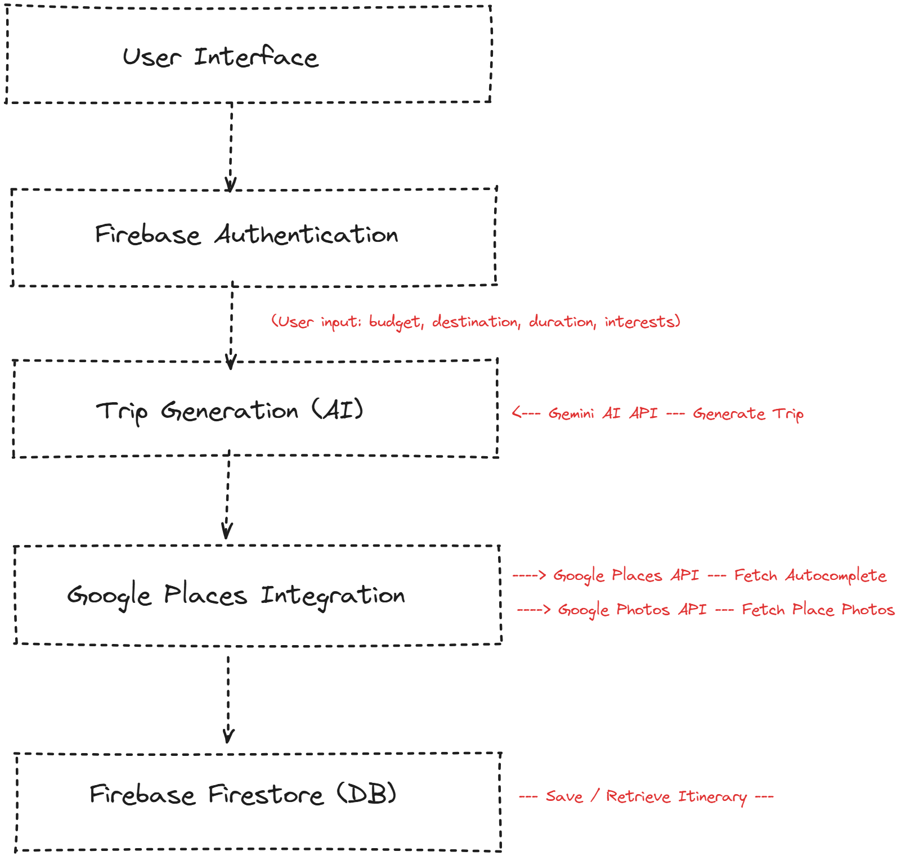
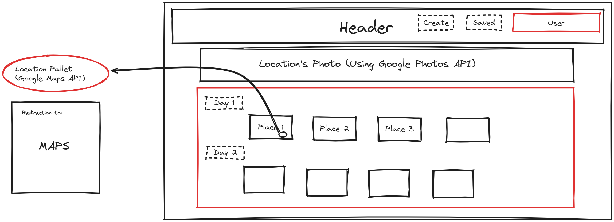
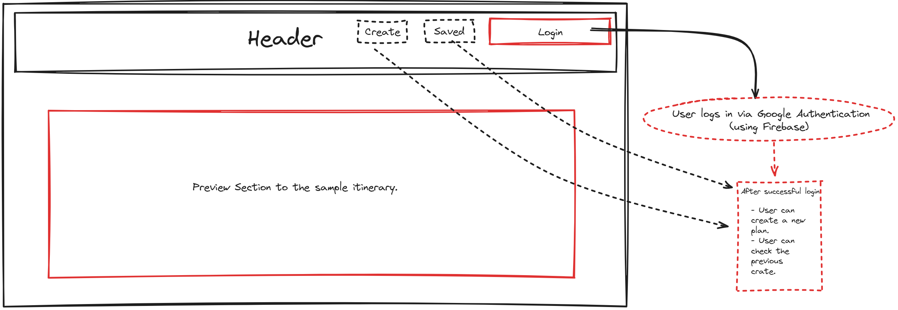

#  Travel Itinerary Generator
##  Overview
The **Personalized Travel Itinerary Generator** is a web application that creates dynamic, AI-powered travel itineraries based on user preferences like budget, interests, and trip duration. It uses **Gemini AI** to generate customized itineraries, **Firebase** for authentication and database storage, and integrates **Google APIs** for places autocomplete and photos.


---

##  Features
- **User Authentication** with Firebase and Google Auth
- **Personalized Trip Itineraries** generated using Gemini AI
- **Google Autocomplete** for destination search
- **Place Photos** using Google Photos API
- **Full Responsiveness** across devices with TailwindCSS
- **Itinerary Storage** and retrieval using Firebase Firestore
- **Clean, user-friendly UI** built with React and shadcn/ui components






---

##  Tech Stack
- **Front-End:** React, TailwindCSS, Vite
- **Back-End:** Firebase (Firestore, Authentication)
- **AI:** Gemini AI (for itinerary generation)
- **APIs:** Google Places API, Google Photos API
- **UI Library:** shadcn/ui for reusable components
- **Routing:** React Router

---

## Firebase Configuration

```javascript
// firebase.js
import firebase from 'firebase/app';
import 'firebase/auth';
import 'firebase/firestore';

const firebaseConfig = {
  apiKey: "YOUR_API_KEY",
  authDomain: "YOUR_AUTH_DOMAIN",
  projectId: "YOUR_PROJECT_ID",
  storageBucket: "YOUR_STORAGE_BUCKET",
  messagingSenderId: "YOUR_MESSAGING_SENDER_ID",
  appId: "YOUR_APP_ID"
};

firebase.initializeApp(firebaseConfig);
const auth = firebase.auth();
const db = firebase.firestore();

export { auth, db };
```

## Environment Variables

```bash
VITE_GOOGLE_PLACES_API_KEY
VITE_GOOGLE_GEMINI_AI_API_KEY
VITE_GOOGLE_AUTH_CLIENT_ID
```

## Google Authentication

```javascript
firebase.auth().signInWithPopup(googleProvider)
  .then((result) => {
    const user = result.user;
    // Handle user session
  })
  .catch((error) => {
    console.error("Error during login: ", error);
  });
```

## Generate Trip (Gemini AI)

```javascript
fetch('/generateTrip', {
  method: 'POST',
  body: JSON.stringify({ budget, destination, duration, interests }),
  headers: { 'Content-Type': 'application/json' },
})
.then(response => response.json())
.then(data => {
  // Handle itinerary generation
})
.catch(error => {
  console.error('Error generating trip: ', error);
});
```

## Autocomplete (Google Places API)

```javascript
fetch(`/placesAutocomplete?input=${destination}`)
  .then(response => response.json())
  .then(data => {
    // Handle autocomplete suggestions
  })
  .catch(error => {
    console.error('Error fetching autocomplete: ', error);
  });
```

## Save Itinerary (Firebase Firestore)

```javascript
firebase.firestore().collection('itineraries').add({
  userId: user.uid,
  itinerary: itineraryData
})
.then(() => {
  console.log("Itinerary saved!");
})
.catch((error) => {
  console.error("Error saving itinerary: ", error);
});
```


